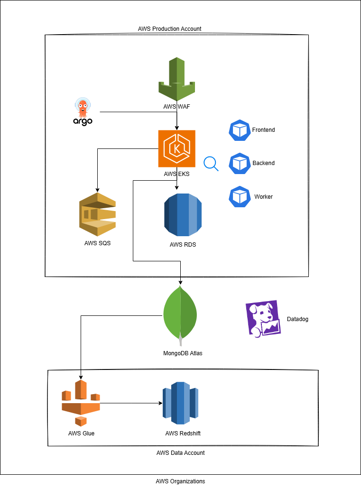

# Engine Interview

## Discussion
>For the panel interview, you will lead a discussion with supporting visuals around a technical design of an architecture that you are very familiar with. This should be a system you've actively contributed to designing, implementing, deploying, and maintaining in production. The model will serve as a focal point for the conversation, which should last about an hour.
>We're not looking for extensive preparation or intricate proprietary details. Rather, we're interested in visuals that show the high-level of the architecture—think boxes with names and lines that would normally happen on a whiteboard during a design session. Your presentation should outline the problem addressed by the architecture, the challenges encountered, the decisions made, how these decisions were made, what might have been differently, which parts you owned, etc.
>During the discussion, you'll lead the conversation, delving into the visual aids as needed to provide deeper insights. The interview should flow like a conversation led by you, and the goal is for the panelists to get a feel for what it is like to work with you.
>We want to gauge your experience and approach in several key areas: Observability, Software Design/Architecture, Automation (this probably covers things like Terraform, CI/CD), Collaboration with Development Teams, Scaling/Performance, Problem-Solving

## High Level Architecture

#### Problem Addressed
- Grow the number of microservices faster
- Scalability and cost efficiency

#### Decisions Made
- Move to EKS: Based on the need for better worker job scalability and microservice orchestration.
- Adopt Terragrunt for Infrastructure Management
- Implement Atlantis for Infra Code Deployment

#### Challenges Encountered
- MongoDB was a bottleneck
- Helm Charts were getting out of control

#### What might have been differently
- More Focus on Developer Enablement – teams struggled with the transition, providing  documentation could have improved adoption.
- More design patterns with Terragrunt - specially around secrets

#### Parts I owned
- Pipelines & Infrastructure as Code (IaC) – I was responsible for CI/CD pipelines and Terragrunt for better infrastructure management.
- Terraform Automation with Atlantis – Enabling PR-based Terraform workflows.
- Infrastructure deployment and security.
- Observability with Datadog